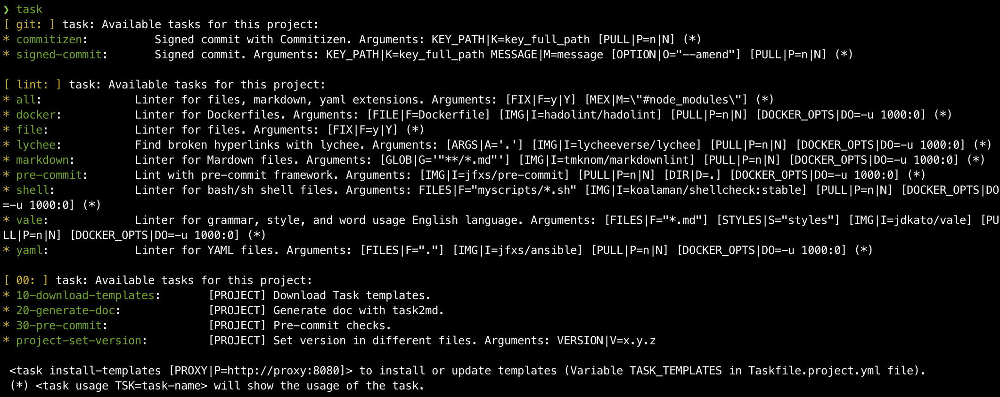

# Task Templates

[](LICENSE)
[](https://gitlab.com/op_so/task/task-templates/pipelines)
[](https://github.com/semantic-release/semantic-release)

A set of reusable [Task](https://taskfile.dev) templates, ready to use.

## Getting Started

### Prerequisities

In order to use:

* [Task](https://taskfile.dev)
* curl
* [Docker](https://docs.docker.com/engine/install/) (recommended): Many templates use Docker images to avoid the need to install any software.

### Installation

* Download the main Taskfile.yml:

```shell
curl --progress-bar -o Taskfile.yml https://gitlab.com/op_so/task/task-templates/-/raw/main/Taskfile.dist.yml
curl --progress-bar -o Taskfile.project.yml https://gitlab.com/op_so/task/task-templates/-/raw/main/Taskfile.project.dist.yml
```

* Select your template(s) by editing the `Taskfile.project.yml` file variable `TASK_TEMPLATES` and run:

```shell
task 10-init-task
```

Or manual installation: edit the Taskfile.yml file and uncomment in the `include:` section the template(s) to use and the `20-t-download:` section of the template(s) to download and run: `task 20-t-download`

* Git:

Taskfile.project.yml is the file that contains your specific project tasks. It should probably be commited.
If you always want the last version of the task templates, add those 2 following lines in your `.gitignore` file

```shell
Taskfile.yml
/Taskfile.d/
```

Otherwise, if you prefer stability you should also commit the `Taskfile.yml` file and the content of the `Taskfile.d` directory.

* Available tasks are shown by execute `task` command without any parameter:


## Authors

* **FX Soubirou** - *Initial work* - [Gitlab repositories](https://gitlab.com/op_so)

## License

This program is free software: you can redistribute it and/or modify it under the terms of the GNU General Public License as published by the Free Software Foundation, either version 3 of the License, or (at your option) any later version. See the [LICENSE](https://www.gnu.org/licenses/gpl-3.0.html) file for details.
